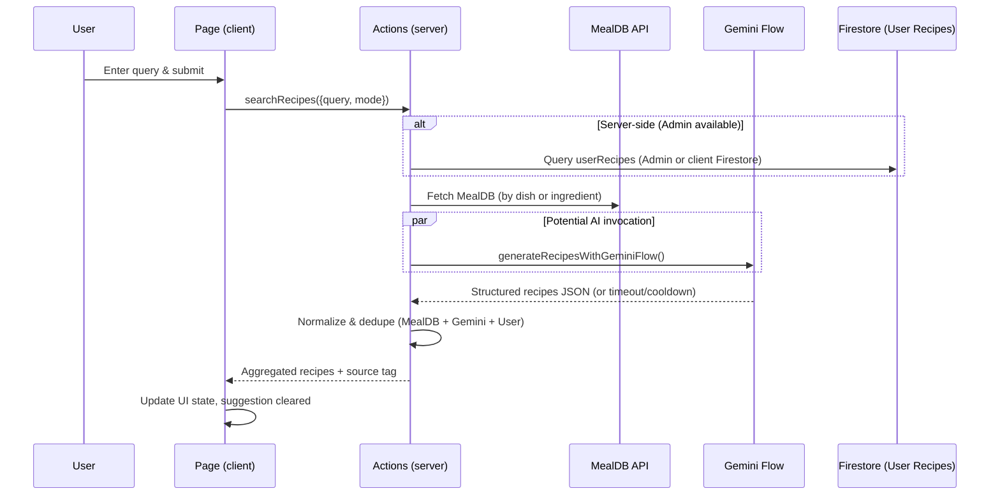
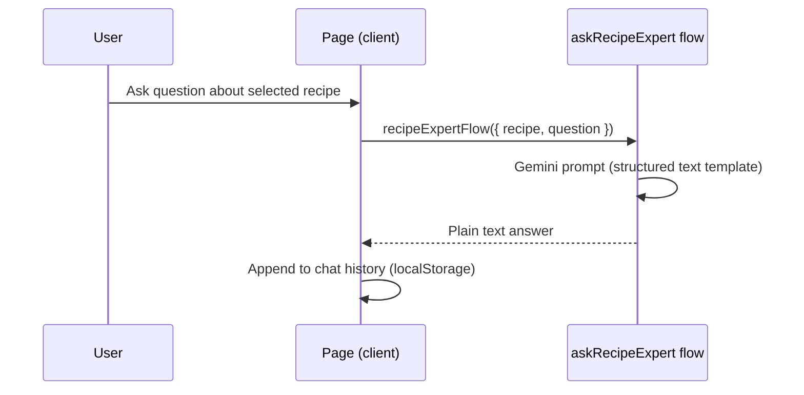
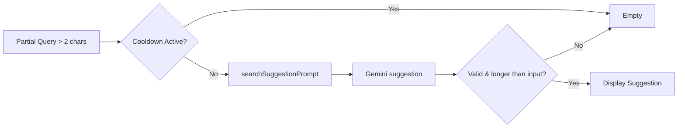
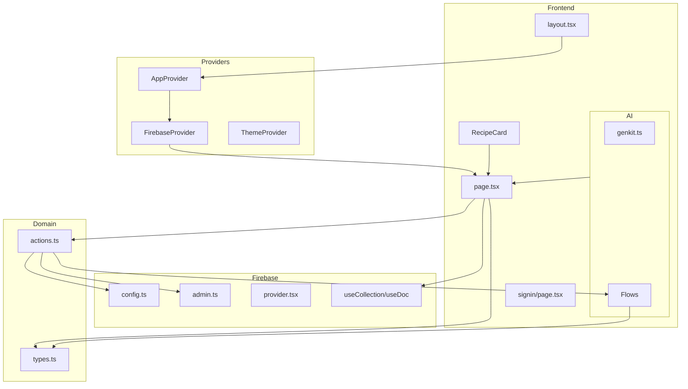

# Project Documentation: Dish Directory (finalsci)

> Comprehensive technical and conceptual documentation for the entire project. This guide explains architecture, technologies, data flows, reasoning behind key code, and how to extend, deploy, and teach the system.

## Table of Contents

1. Overview & Purpose
2. Technology Stack Summary
3. High-Level Architecture
4. Environments & Configuration
5. Application Layers
   - 5.1 Next.js App Layer
   - 5.2 UI Design System & Components
   - 5.3 State & Hooks
   - 5.4 Firebase Integration (Client & Admin)
   - 5.5 AI Layer (Genkit + Gemini + Imagen)
   - 5.6 Domain Model & Types
   - 5.7 Actions & Business Logic
6. Data Flows & Sequence Diagrams
7. Important Modules Walkthrough
8. Error Handling & Observability
9. Performance, Caching & Quotas
10. Styling & Theming
11. Security & Permissions
12. Local Development Workflow
13. Deployment (Firebase Hosting & App Hosting Backend)
14. Teaching Guide / Learning Path
15. Extensibility Roadmap & Next Steps
16. Glossary

---

## 1. Overview & Purpose

Dish Directory is a modern, real-time recipe exploration and creation platform. It blends:

- Public recipe data from TheMealDB
- User-submitted recipes with media uploads
- AI-assisted recipe generation (Gemini) and image generation (Imagen)
- Interactive AI expert Q&A per recipe
- Search suggestion AI assistance

The goal: act as a showcase and reference implementation for building a full-stack AI-augmented Next.js + Firebase application with clean architectural boundaries.

## 2. Technology Stack Summary

| Layer | Technology | Notes |
|-------|------------|-------|
| Frontend | Next.js 15 (App Router) | SSR/ISR capable; using turbopack in dev. |
| Styling | TailwindCSS + custom tokens | Extended theme via CSS variables. |
| Components | Radix UI primitives + custom wrappers | Accessible UI patterns. |
| State | React hooks + localStorage + custom emitter | Minimal global state; context injection via providers. |
| Auth | Firebase Authentication | Google & Email/Password. |
| Data | Firestore (client + Admin SDK) | Real-time reads, server actions. |
| Storage | Firebase Storage | User recipe images. |
| AI | Genkit (Gemini & Imagen) | Structured flows via `definePrompt` & `defineFlow`. |
| Validation | Zod | Input/output schema enforcement for AI flows & domain types. |
| Utilities | `uuid`, `date-fns`, `clsx`, `tailwind-merge` | Common helpers. |
| Deployment | Firebase Hosting + App Hosting backend | `firebase.json` + `apphosting.yaml`. |

## 3. High-Level Architecture

```text
+---------------------------------------------------------------+
|                            Browser                            |
|  - Next.js pages/components                                   |
|  - Hooks (data, auth, UI)                                     |
|  - LocalStorage (chat history, recently viewed)               |
+-----------------------^--------------------^------------------+
                        |                    |
                        |                    |
                Firestore real-time      Server Actions / AI
                        |                    |
+-----------------------v--------------------v------------------+
|                        Next.js Server                        |
|  - Server Actions in `src/lib/actions.ts`                    |
|  - AI flows (Genkit)                                         |
|  - Uses Admin Firestore when on server (for userRecipes)     |
+-----------------------^--------------------^------------------+
                        |                    |
                        | Firebase Admin SDK |
                        |                    |
+-----------------------v---------------------------------------+
|                       Firebase Services                      |
|  Auth | Firestore | Storage | Hosting | App Hosting          |
+---------------------------------------------------------------+
| External APIs: TheMealDB + Google AI (Gemini / Imagen)        |
+---------------------------------------------------------------+
```

### Layering Principles

- Presentation: Pages + components know how to render; they call actions/hooks rather than embedding data fetching logic ad hoc.
- Domain: Central types (`src/lib/types.ts`) unify shape across sources (MealDB, Gemini AI, and user submissions).
- AI: Flows encapsulate prompt + schema logic and return structured output. Server actions orchestrate choosing sources & fallback.
- Data Access: Hooks wrap Firestore listeners; server actions perform fetch/aggregation & normalization.

## 4. Environments & Configuration

Environment variables (client exposed) must be prefixed with `NEXT_PUBLIC_` for Firebase config.

```env
NEXT_PUBLIC_FIREBASE_API_KEY
NEXT_PUBLIC_FIREBASE_AUTH_DOMAIN
NEXT_PUBLIC_FIREBASE_PROJECT_ID
NEXT_PUBLIC_FIREBASE_STORAGE_BUCKET
NEXT_PUBLIC_FIREBASE_MESSAGING_SENDER_ID
NEXT_PUBLIC_FIREBASE_APP_ID
FIREBASE_SERVICE_ACCOUNT_JSON # server only; for Admin SDK
```

`firebase.json` configures hosting & storage rules. `apphosting.yaml` constrains backend instances (`maxInstances: 1`).

`next.config.ts` loosens build strictness (`ignoreBuildErrors: true`, `ignoreDuringBuilds: true`) and defines remote image patterns.

`tailwind.config.ts` sets design tokens via CSS variables mapped to semantic color groups plus animation utilities.

## 5. Application Layers

### 5.1 Next.js App Layer

Key files:

- `src/app/layout.tsx` – Root layout injecting `ThemeProvider` and `AppProvider` and global fonts (Inter, Playfair_Display).
- `src/app/page.tsx` – Core interactive homepage: search, AI suggestion, trending, recipe modal, chat history, local persistence.
- `src/app/signin/page.tsx` – Auth page handling sign-in & sign-up flows (email/password + Google).
- `src/app/app-provider.tsx` – Composes `FirebaseProvider` & `AuthProvider` for downstream hooks.

### 5.2 UI Design System & Components

Uses Radix primitives wrapped in custom components under `src/components/ui/`. Domain-specific components reside under `src/components/app/` (e.g., `recipe-card.tsx`, `ai-search-input.tsx`).

Patterns:

- Composition over inheritance
- Stateless presentation components receiving callbacks via props
- Accessibility: leverages Radix's ARIA foundations

Example: `RecipeCard` uses graceful image fallback + action buttons (open detail, AI chat trigger). `AiSearchInput` overlays a disabled input behind user input to visually show AI suggestion prefix.

### 5.3 State & Hooks

Custom hooks:

- `useLocalStorage` – Persistent state with hydration-safe fallback.
- `useMemoFirebase` – Marks objects (queries/refs) as memoized to prevent infinite loops; attaches a non-enumerable `__memo` flag checked by Firestore hooks.
- `useCollection` / `useDoc` – Real-time Firestore listeners with permission-aware error emission.
- `useIsMobile` – Media query hook for responsive logic.
- `useToast` – Custom toast state machine (similar to `react-hot-toast` but simplified).

State Philosophy:

- Keep server-derived data ephemeral unless user-centric (recently viewed / chat history) stored in localStorage keyed per user ID.
- Separate UI ephemeral states (`isModalOpen`, `isGenerating`) from domain caches.

### 5.4 Firebase Integration (Client & Admin)

Client config (`src/firebase/config.ts`) ensures ENV presence via `ensureEnv`. Exposes `firestore`, `auth`, `storage` singletons. Provider (`src/firebase/provider.tsx`) supplies `firebaseApp`, `firestore`, `auth`, and user state through context.

Admin integration (`src/firebase/admin.ts`) parses service account JSON (supports raw, wrapped, or base64) and lazily initializes Firestore Admin for server-side queries that bypass client limits (user recipe search).

Error handling:

- `FirestorePermissionError` builds a pseudo Firestore security rule request object to enrich error messages for debugging and future AI interpretation.
- `errorEmitter` provides a typed event bus used by hooks to broadcast permission errors globally.

### 5.5 AI Layer (Genkit + Gemini + Imagen)

`src/ai/genkit.ts` – Initializes Genkit with Google AI plugin. `src/ai/dev.ts` – Bootstraps flows for local Genkit dev server.

Flows:

1. `generate-recipes-with-gemini.ts`
   - Prompt: Structured JSON enforcing schema via `GeminiRecipeListOutputSchema`.
   - Post-processing: Strips markdown fences, braces search, JSON parse, schema validation (Zod). Ensures robust fallback.
2. `ask-recipe-expert-flow.ts`
   - Takes a recipe object + question; returns plain text answer (format sanitation enforced).
3. `generate-image-flow.ts`
   - Calls Imagen model with a descriptive prompt; returns `media.url` or undefined on error.
4. `generate-search-suggestion-flow.ts`
   - Suggests autocompletion based on partial query; includes rate limiting & quota handling with cooldown.

Design Choice: Each flow isolates prompt + validation vs mixing inside business logic. This improves testability and systematic error handling.

### 5.6 Domain Model & Types

Central types: `src/lib/types.ts`

- Unifies `MealDBRecipe` raw shape and normalized `Recipe` / `RecipeSummary`.
- Distinguishes sources: `'TheMealDB' | 'Gemini' | 'User'` for provenance tracking.
- Zod schemas for AI input/output contract ensure reliability across untrusted AI data.

### 5.7 Actions & Business Logic (`src/lib/actions.ts`)

Core responsibilities:

- Aggregated search across sources (User Firestore, MealDB API, Gemini fallback/augmentation).
- Normalization functions (MealDB → `Recipe`, Gemini JSON → `Recipe`).
- Intelligent AI invocation strategy with throttle, cooldown, cache TTL (5 minutes), fallback extended timeout.
- Upload user recipe: Storage upload + Firestore doc creation.
- Contact form submission.
- Trending recipes: Parallel random fetch with dedupe.

Mechanisms:

- `withTimeout` race to avoid hanging on AI calls.
- `geminiSearchCache` prevents redundant model invocations.
- Source resolution returns `Combined` when multiple origins contribute.

## 6. Data Flows & Sequence Diagrams

### 6.1 Search & Recipe Generation



### 6.2 Recipe Expert Q&A



### 6.3 User Recipe Submission

```mermaid
flowchart LR
  A[FormData (name, ingredients, image)] --> B[Upload Image to Storage]
  B --> C[Get Download URL]
  C --> D[Firestore addDoc userRecipes]
  D --> E[Return success message]
```

### 6.4 AI Search Suggestion



### 6.5 Architecture Component Overview



## 7. Important Modules Walkthrough

### `generate-recipes-with-gemini.ts`

Key ideas:

- Prompt enforces JSON output—explicit type to combat hallucinations.
- Strips unwanted markdown wrappers (handles AI tendency to wrap in ```json fences).
- Validates shape (`GeminiRecipeListOutputSchema.safeParse`).
- Ensures `recipes` is an array even if empty (structural guarantee).

Edge Cases Handled:

- Empty response → error throw
- Malformed JSON → error with logging
- Quota exceed or invalid schema → fallback logic in `actions.ts` (cooldown, aggregated search).

### `searchRecipes` (in `actions.ts`)

Responsibilities include:

- Multi-source fetch (User, MealDB, Gemini concurrently / conditionally).
- Throttle & cooldown for Gemini to avoid quota spikes.
- Caching AI results keyed by mode + normalized query.
- Extended timeout fallback only if no other sources produced results.

Edge Cases:

- Quota exceeded (429) → sets cooldown.
- AI timeout → fallback extended wait.
- Mixed source dedupe by lower-cased name.

### Firestore Hooks: `useCollection` / `useDoc`

- Real-time subscription using `onSnapshot`.
- Transparent error wrapping into `FirestorePermissionError` with path + operation context.
- Enforces memoization contract: throws if passed reference lacks `__memo` flag from `useMemoFirebase`.

### Error Modeling: `FirestorePermissionError`

- Builds a rules-like object with simulated `request.auth` shape.
- Structured JSON string appended to Error message to aid developer debugging and potential AI log mining.

### `useToast`

- Local reducer pattern with side-effect for delayed removal.
- Controlled open state enabling manual dismissal or auto queue limitation.
- Simplicity: single toast limit (`TOAST_LIMIT = 1`) ensures clear UX.

## 8. Error Handling & Observability

Patterns:

- Console logging structured errors (normalized AI parsing errors, Firebase permission errors).
- Central emitter for permission errors enabling global UI listeners (e.g., `FirebaseErrorListener` component placeholder).
- Defensive parsing steps for AI JSON.
- Guard environment variable presence early (fail fast).

Recommendation (Future): integrate Sentry or OpenTelemetry for production tracing; log AI latency & source selection metrics.

## 9. Performance, Caching & Quotas

Strategies:

- AI search suggestion cooldown prevents spamming Gemini for short queries.
- Recipe generation uses throttle interval & TTL cache (5 min) to minimize repeated generation for identical queries.
- Parallel requests for trending recipes (8 random calls) distribute user visible content variety; dedupe prevents flicker.
- LocalStorage caches user-specific histories (avoids redundant Firestore writes).

Potential Enhancements:

- Add SWR or React Query for caching server actions.
- Pre-warm AI flows on server boot.
- Introduce image optimization and edge caching via Next.js middleware.

## 10. Styling & Theming

- Dark mode toggled via `next-themes` provider; tokens defined using `hsl(var(--token))` pattern for dynamic theme switching.
- Custom `data-theme` attribute on `<html>` drives color variations (`orange`, `blue`, `green`, `rose`).
- Tailwind config extends fonts, animations (accordion, fade-in), and radial token mapping for charts and sidebar.

## 11. Security & Permissions

- Client-side Firestore rules assumed to restrict unauthorized doc access (rules file not fully documented here—should ensure user-specific collections security).
- Admin SDK used only server-side, guarded by presence of service account JSON.
- Upload path namespaced by `authorId` to avoid collisions.
- Error object includes auth context for rapid diagnosis.

Suggested Hardening:

- Validate `authorId` matches authenticated user before allowing recipe submission.
- Sanitize and limit ingredient array size & description length.
- Enforce MIME type validation on image uploads.

## 12. Local Development Workflow

Use turbopack dev server:

```bash
pnpm install
pnpm dev
```

Run Genkit flows locally (if using CLI):

```bash
pnpm run genkit:dev
```

Type checking & linting:

```bash
pnpm typecheck
pnpm lint
```

Environment Setup:

- Create `.env.local` with Firebase keys (Next.js auto loads).
- For Admin features, set `FIREBASE_SERVICE_ACCOUNT_JSON` or `FIREBASE_SERVICE_ACCOUNT_KEY` (base64) when running server actions requiring admin access.

## 13. Deployment (Firebase)

Hosting:

- `firebase.json` root hosting config: ignores `node_modules` and dotfiles. Frameworks backend region: `us-central1`.
- `apphosting.yaml` defines `maxInstances: 1` for cost control in backend functions runtime.

Deployment Outline:

1. Build: `pnpm build`
2. Deploy: `firebase deploy` (requires proper `firebaserc` project alias).
3. Ensure service account set in project environment (if using Cloud Run / functions for server actions requiring admin access).

## 14. Teaching Guide / Learning Path

Recommended progressive teaching modules:

1. Fundamentals: Next.js app router + layout/components.
2. Firebase Client Integration: Auth, Firestore reads via hooks.
3. Server Actions & Normalization: Build `searchRecipes` without AI first.
4. Data Modeling & Zod: Introduce schemas + validation.
5. AI Integration with Genkit: Simple prompt → structured JSON.
6. Error Robustness: Handle malformed AI responses.
7. Performance: Add caching & throttling strategies.
8. Extensibility: User submissions + image upload.
9. Observability: Designing error events / future logging.
10. Theming & Design System: Tailwind tokens & Radix primitives.

Each step can be a lab exercise with incremental code reveals.

## 15. Extensibility Roadmap & Next Steps

Short-Term:

- Add pagination to search results.
- Implement user profile and favorites collection.
- Provide offline-friendly caching (Service Worker).

Medium-Term:

- Introduce AI chat memory contextualization (pass previous Q&A back to flow).
- Multi-language support using i18n + AI translation fallback.
- Metrics dashboard (recipe popularity, AI usage quotas).

Long-Term:

- Role-based access control (admin moderation of user recipes).
- Vector similarity search for ingredient substitution recommendations.
- Automatic nutrition estimation via AI + external API.

## 16. Glossary

- Flow (Genkit): A structured unit combining prompt logic + input/output schema.
- Normalization: Transforming heterogeneous external response into unified internal `Recipe` shape.
- Cooldown: Time window preventing repeated AI invocation after quota or error.
- Throttling: Rate limiting successive calls to avoid bursts.
- LocalStorage Persistence: Saving per-user ephemeral history in browser storage keyed by UID.
- Dedupe: Removing duplicate recipes by canonical lower-cased name.

---

## Appendix A: Code Snippet Highlights

### AI JSON Sanitization (Excerpt)

```ts
if (rawText.startsWith('```')) {
  rawText = rawText.replace(/^```[a-zA-Z0-9_-]*\s*/, '').replace(/```$/, '').trim();
}
```

Purpose: Remove markdown fences, a frequent LLM output artifact.

### Memoization Contract

```ts
if (memoizedTargetRefOrQuery && !memoizedTargetRefOrQuery.__memo) {
  throw new Error(`${memoizedTargetRefOrQuery} was not properly memoized`);
}
```

Prevents runaway re-subscriptions in Firestore listeners.

### AI Suggestion Cooldown

```ts
if (Date.now() < suggestionCooldownUntil) {
  return { suggestion: '' };
}
```

Stops wasteful calls during provider quota exhaustion.

### Service Account Parsing Robustness

```ts
const json = unwrapped.startsWith('{') ? unwrapped : Buffer.from(unwrapped, 'base64').toString('utf8');
```

Supports both direct JSON and base64-encoded secrets.

### Ingredient Normalization Loop

```ts
for (let i = 1; i <= 20; i++) {
  const ingredient = meal[`strIngredient${i}`];
  // ...
}
```

Extracts a variable number of ingredients without manual mapping.

---

## Appendix B: Teaching Checklist

| Concept | Demonstration File | Exercise Idea |
|---------|--------------------|---------------|
| Context Providers | `app-provider.tsx` | Add new provider (e.g., feature flags). |
| Firestore Hook | `use-collection.tsx` | Build a filtered query hook. |
| AI Flow | `generate-recipes-with-gemini.ts` | Add nutrition estimation flow. |
| Error Modeling | `errors.ts` | Extend to include request headers. |
| Caching | `actions.ts` | Build LRU cache for AI responses. |

---

## Completion Summary

This documentation synthesizes every significant part of the repository: configuration, architecture, flows, hooks, components, actions, error strategy, performance tactics, and future roadmap. It is structured for both onboarding and instructional use.

If you need a PDF export or split into module-specific docs, that can be added next.
